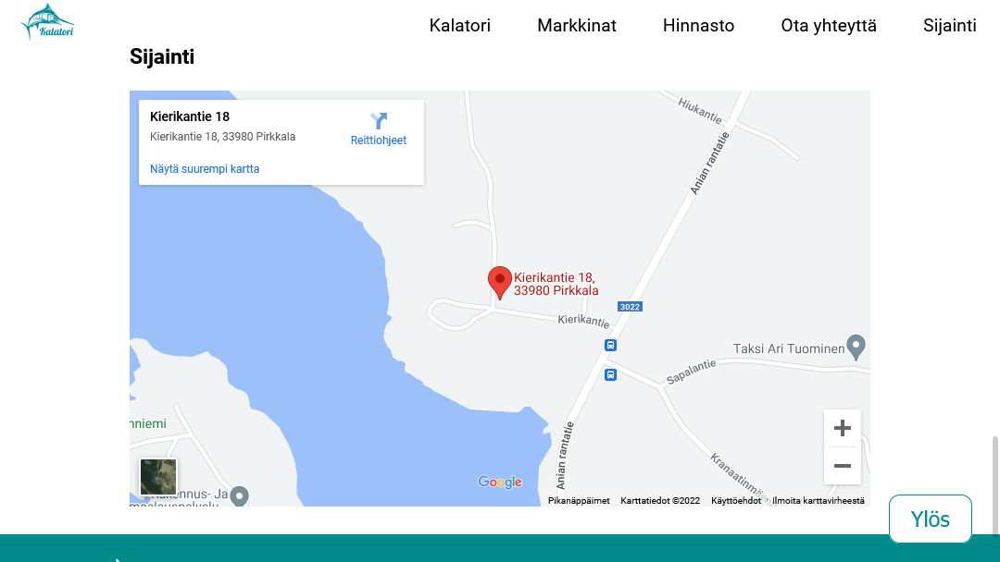

# Kalatori nettisivut
## Sähköinen asiointipalvelu -kurssin harjoitustyö

| Projekti  | Nettisivut |
| ------------- |:-------------:|
| Tekijä      | Aki Kurvinen     |
| Tekniikat      | HTML & CSS    |

## Komponentit
- nav
  - Responsiivinen navigaatio
  - Toteutettu Ankkulirinkeillä
  - Kalatorin logo
- header
  - Hero-kuva
  - Pääotsikko
  - Kuvausteskti torista
- section (markkinat)
  - Markkinoiden ajankohdat
  - Kuvituskuvia
- section (hinnasto)
  - Torikarttakuva
  - Hinnastotaulukko
- section (yhteystiedot)
  - Myyntipöydän varauslomake
- section (sijainti)
  - Upotettu Google maps
- footer
  - Yhteystiedot
  - Some-linkit

## Julkaisut

### Julkaisu 1
- nav
- header
- section (markkinat)
- section (hinnasto)

### Julkaisu 2
Lisätty:
- section (yhteystiedot)
- section (sijainti)
- footer

## Kuvakaappaukset

